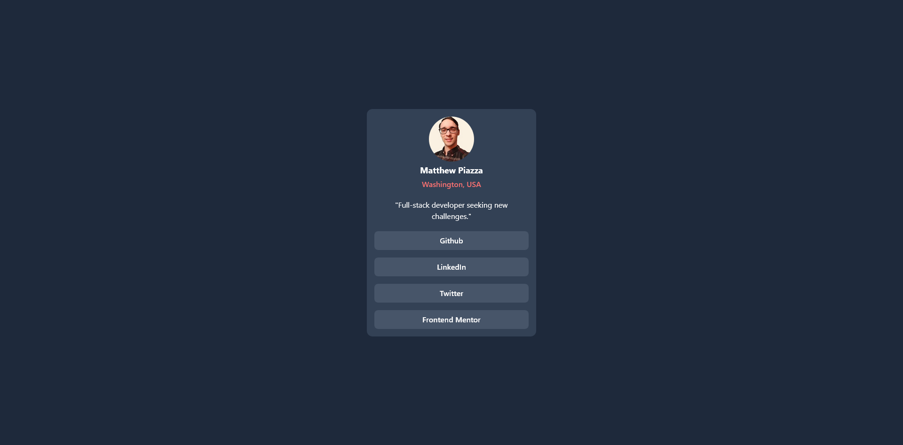
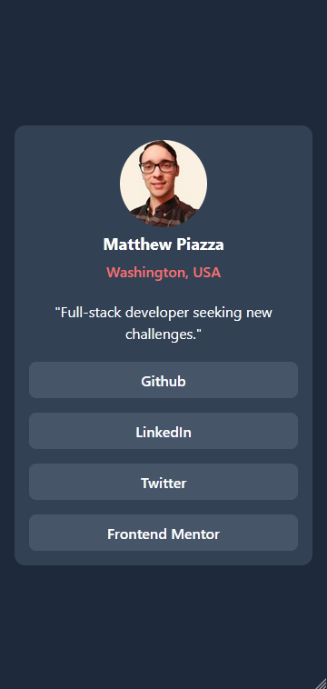

# Frontend Mentor - Social links profile solution

This is a solution to the [Social links profile challenge on Frontend Mentor](https://www.frontendmentor.io/challenges/social-links-profile-UG32l9m6dQ). Frontend Mentor challenges help you improve your coding skills by building realistic projects.

## Overview

### Screenshot

### Links

- [Hosted with github pages](https://j-dax.github.io/login-fem/index.html)

### Built with

- Semantic HTML5 markup and ARIA
- TailwindCSS, grid, flexbox

## Author

- Website - [JDax]() - Maybe I'll make one this month
- Frontend Mentor - [@j-dax](https://www.frontendmentor.io/profile/j-dax)
